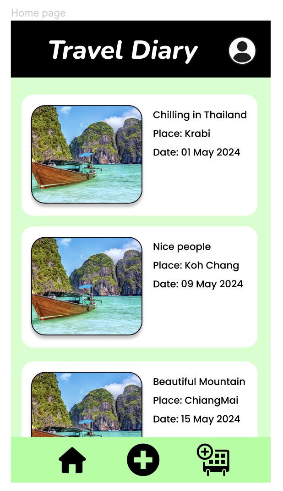
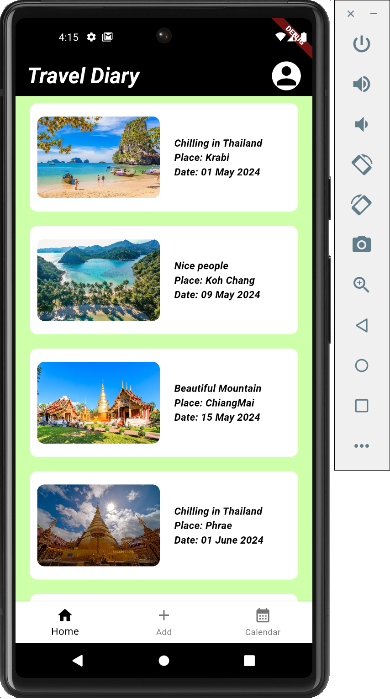

# Exercise 2: Widget from One Page from your Figma

**Kontawat Wisetpaitoon 6388154**

Select one page (difference from your team members) from your project proposal, login or logout page is excluded.

Page should be simple one to start how to apply widget layout(Row, Col,  Container Text, image, icon or necessary components for your final project).

## Getting Started

For this exercise, I select the page of the "Travel Diary Overview" this page is the overview of palce that user has been visited.

this is the design image of the page:

this is the result of the page:

