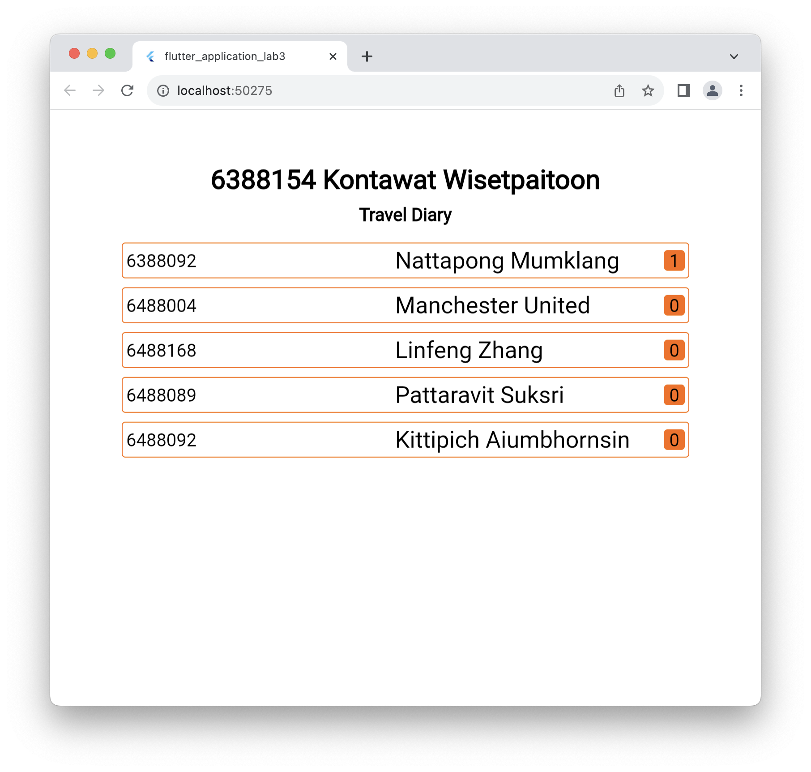
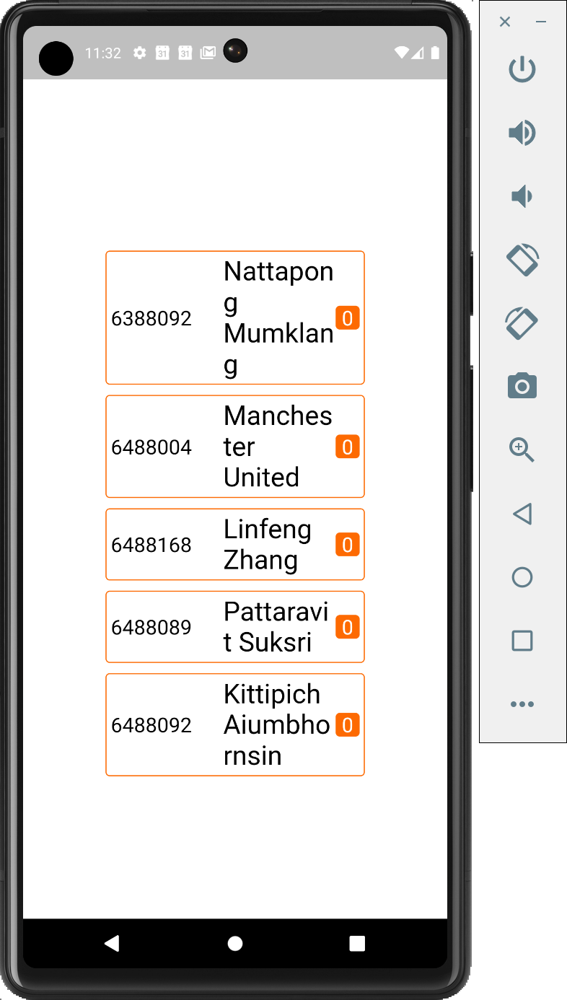

# flutter_application_lab3

A new Flutter project.

## Getting Started

This project is one of the labs for the course "Mobile Application Development" at the Mahidol University.

## How to run

1. Clone this repository
2. Open the project in Android Studio or Visual Studio Code
3. Run the project using the emulator or a real device
4. Enjoy!

```
flutter run
```

## Screenshots



