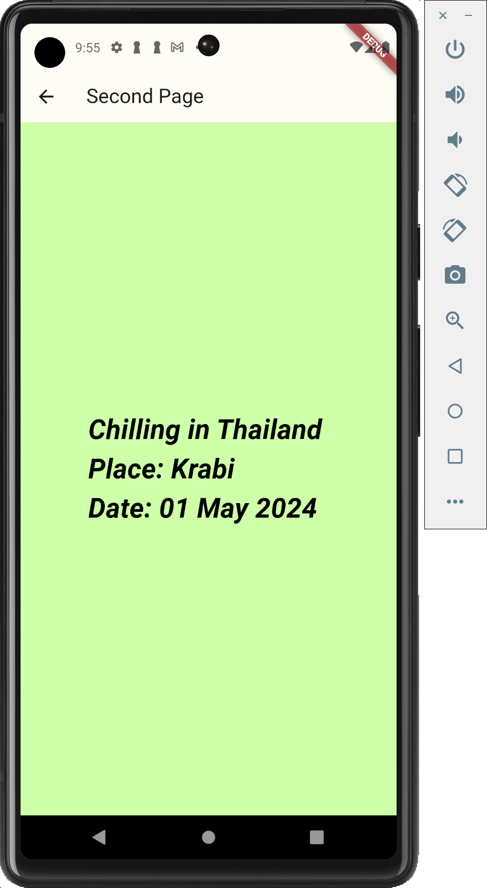

# w5_6388154_route

- Select main page (from figma) show , button to switch to next page and passing argument to second route. 

- At second page process your input data from first page and show result on second page 
  - go back to Home page

## First Page
- Show main page 

## Second Page
- Click on "Go to Second Page" button to go to second page

https://github.com/Nightsky-na/Lecture_Wireless-and-Mobile-Computing/tree/main/w5_6388154_route 
